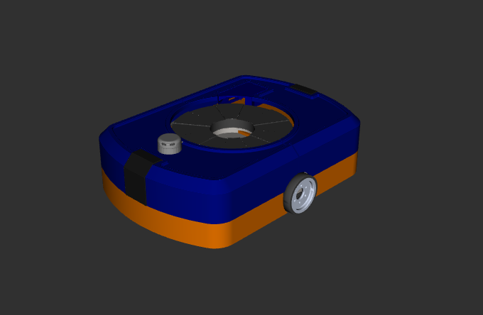
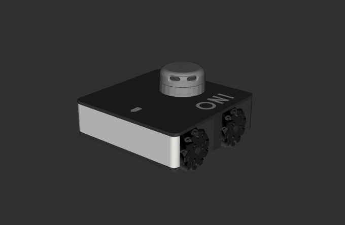

<h1>Laser Unmanned Ground Vehicle System</h1>

   

      

         
      

   

<h2>Description</h2>

   The Laser-Robotics is a robotics lab at the UFPB. We work with ground and
   aerial robots, we developed this plataform for academic use in the robotic
   subject of the Computer Enginnering program. 
    🚧 Does not work with
   multiple robots (yet...) 🚧

<h2>Contents</h2>
<ul>
   <li><a href="#Description">Description</a></li>
   <li><a href="#Contents">Contents</a></li>
   <li><a href="#Requirements">Requirements</a></li>
   <li><a href="#L1BR">L1BR</a></li>
   <li><a href="#Oni">Oni</a></li>
   <li><a href="#Installation">Installation</a></li>
   <li><a href="#RunningTheSimulation">Running the simulation</a></li>
   <ul>
   <li><a href="#StartingWorld">Starting world</a></li>
   <li><a href="#SpawningRobot">Spawning robot</a></li>
   <li><a href="#Control">Control</a></li>
   </ul>
</ul>

<h2>Requirements</h2>
<ul>
   <li>Ubuntu 20.04</li>
   <li><a href="https://docs.ros.org/en/noetic/">ROS Noetic</a></li>
   <li>Gazebo</li>
</ul>

<h2>L1BR</h2>

L1BR is a differencial robot who can move around a warehouse to go under the shelves and lift them to other positions.

   

      

         
      

   

<h2>Oni</h2>

Oni is a omnidirectional robot that was made for academic purposes so students can test a omnidirectional robot.

   

      

         
      

   

<h2>Installation</h2>

In your workspace inside the <code>src</code> folder do the following command:

<pre>
git clone https://github.com/LASER-Robotics/ugv_system.git
cd ugv_system
git checkout ros-Noetic
chmod +x setup_enviroment.sh
./setup_enviroment.sh
</pre>

To build the packages go to your workspace and do the following command:

<pre>
catkin build
</pre>

<h2>Running the simulation</h2>
<h3>Starting world</h3>

Run this command:
<pre>
roslaunch ugv_simulation world_launch.launch
</pre>
If you want to change the world, go to <code>ugv_system/ugv_simulation/worlds</code> and place the new <code>.world</code> file. Still in the <code>worlds</code> folder, run the following command changing <code>world_name</code> by your world's name.
<pre>
roslaunch ugv_simulation world_launch.launch world:=world_name.world
</pre>

<h3>Spawning robot</h3>

<ul>
<li>L1BR</li>
</ul>
<pre>
roslaunch ugv_robots_descriptions l1br_description_launch.py
</pre>

<ul>
<li>Oni</li>
</ul>
<pre>
roslaunch ugv_robots_descriptions oni_description_launch.py
</pre>

<h3>Control</h3>

Run this command to control your robot with keyboard:
<ul>
<li>L1BR</li>
</ul>
<pre>
rosrun teleop_twist_keyboard teleop_twist_keyboard.py
</pre>
<ul>
<li>Oni</li>
</ul>
<pre>
rosrun teleop_twist_keyboard teleop_twist_keyboard.py --ros-args-r /cmd_vel:=/oni/cmd_vel
</pre>

