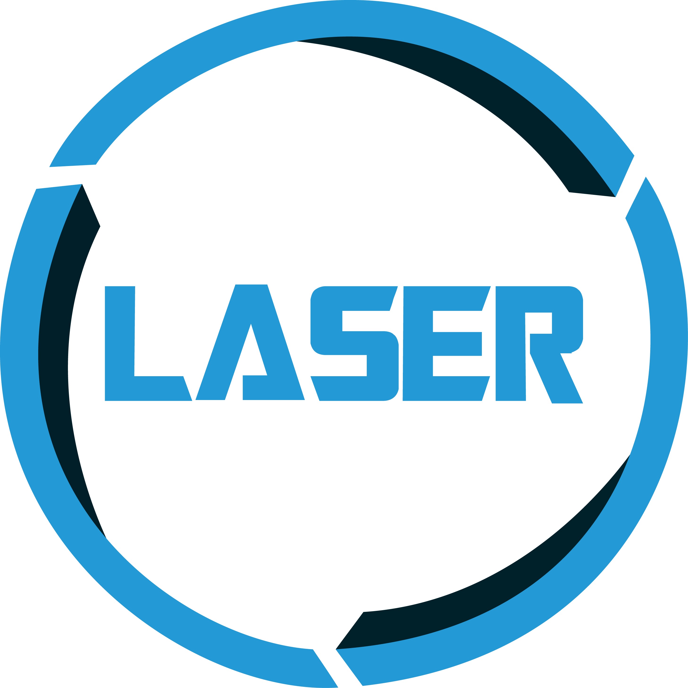

<!--

   Unmanned Ground Vehicle System

   

      

         
         
L1BR

      

      

         
         
ONI

      

   

-->

<h1>Laser Unmanned Ground Vehicle System</h1>

   

      

         
      

   

<h2>Description</h2>

   The Laser-Robotics is a robotics lab at the UFPB. We work with ground and
   aerial robots, we developed this plataform for academic use in the robotic
   subject of the Computer Enginnering program. 
    🚧 Does not work with
   multiple robots (yet...) 🚧

<h2>Contents</h2>
<ul>
   <li><a href="#Description">Description</a></li>
   <li><a href="#Contents">Contents</a></li>
   <li><a href="#Requirements">Requirements</a></li>
   <li><a href="#L1BR">L1BR</a></li>
   <li><a href="#Oni">Oni</a></li>
</ul>

<h2>Requirements</h2>
<ul>
   <li>Ubuntu 22.04</li>
   <li><a href="https://docs.ros.org/en/humble/">ROS 2 Humble</a></li>
   <li>Gazebo</li>
</ul>

<h2>L1BR</h2>
<h3>Overview</h3>

L1BR is a differencial robot who can move around a warehouse to go under the shelves and lift them to other positions.

   

      

         
      

   

<h2>Oni</h2>
<h3>Overview</h3>

Oni is a omnidirectional robot that was made for academic purposes so students can test a moveable robot.

   

      

         
      

   

<!-- Instalação -->
<!-- Como rodar as coisas -->