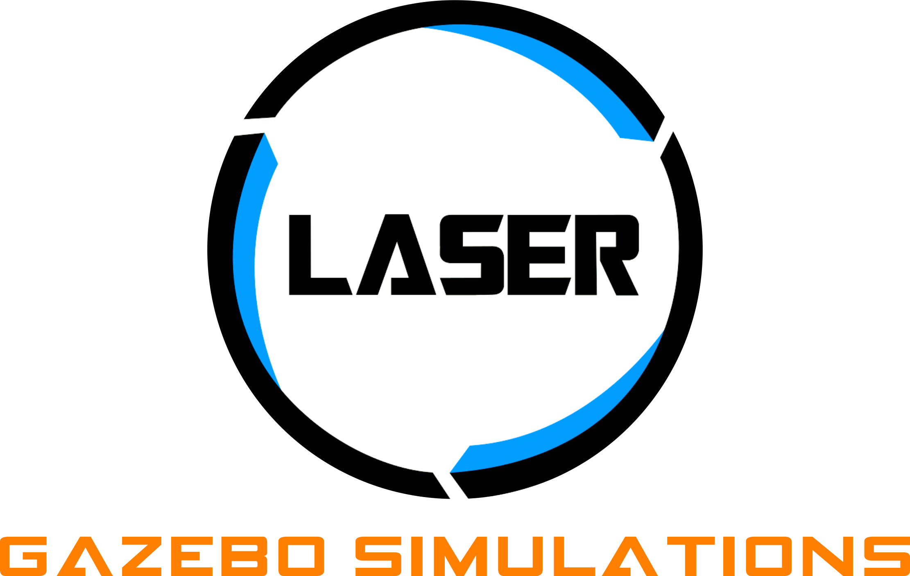

<h1>Laser Unmanned Ground Vehicle System</h1>

   

   <table>
      <tr>
         <th></th>
         <th></th>
      </tr>
   </table>

<h2>Contents</h2>
<ul>
    <li><a href="#Description">Description</a></li>
    <li><a href="#Contents">Contents</a></li>
    <li><a href="#Requirements">Requirements</a></li>
</ul>

   

   <table>
      <tr>
         <th></th>
         <th></th>
      </tr>
   </table>

   

   <table>
      <tr>
         <th></th>
         <th></th>
      </tr>
   </table>

<h2>Description</h2>

The Laser-Robotics is a robotics lab at the UFPB. We work with ground and aerial robots, we developed this plataform for academic use in the robotic subject of the Computer Enginnering program.

🚧 Does not work with multiple robots (yet...) 🚧

   

   <table>
      <tr>
         <th></th>
         <th></th>
      </tr>
   </table>

   

   <table>
      <tr>
         <th></th>
         <th></th>
      </tr>
   </table>

   

   <table>
      <tr>
         <th></th>
         <th></th>
      </tr>
   </table>

<h2>Requirements</h2>
<ul>
    <li>Ubuntu 22.04</li>
    <li><a link = "https://docs.ros.org/en/humble/">ROS 2 Humble</a></li>
</ul>

<ol>
   <li>tag para colocar lista</li>
   <li>asdf</li>
</ol>

   

   <table>
      <tr>
         <th></th>
         <th></th>
      </tr>
   </table>

